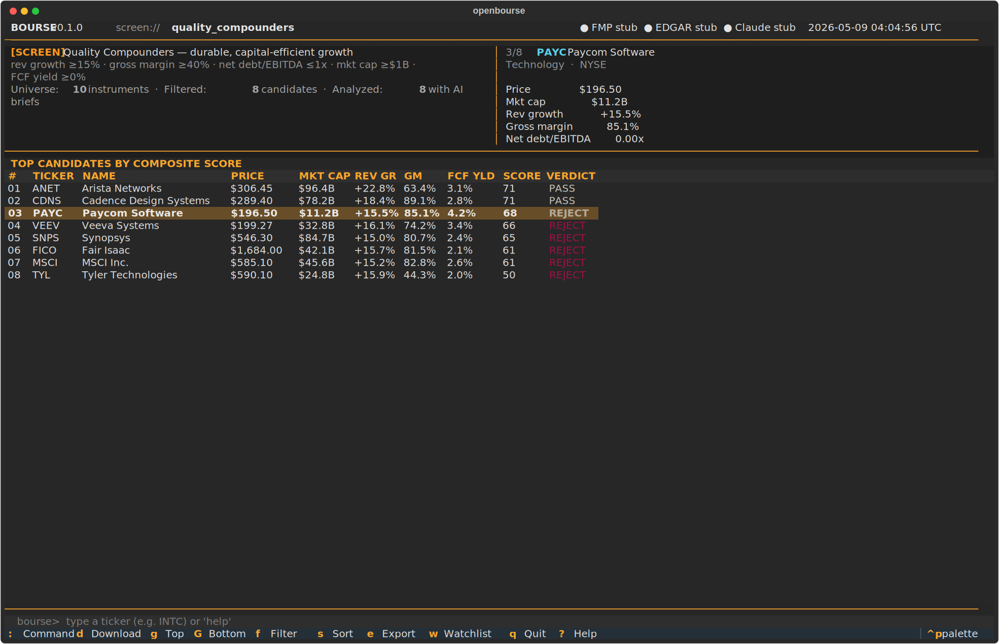
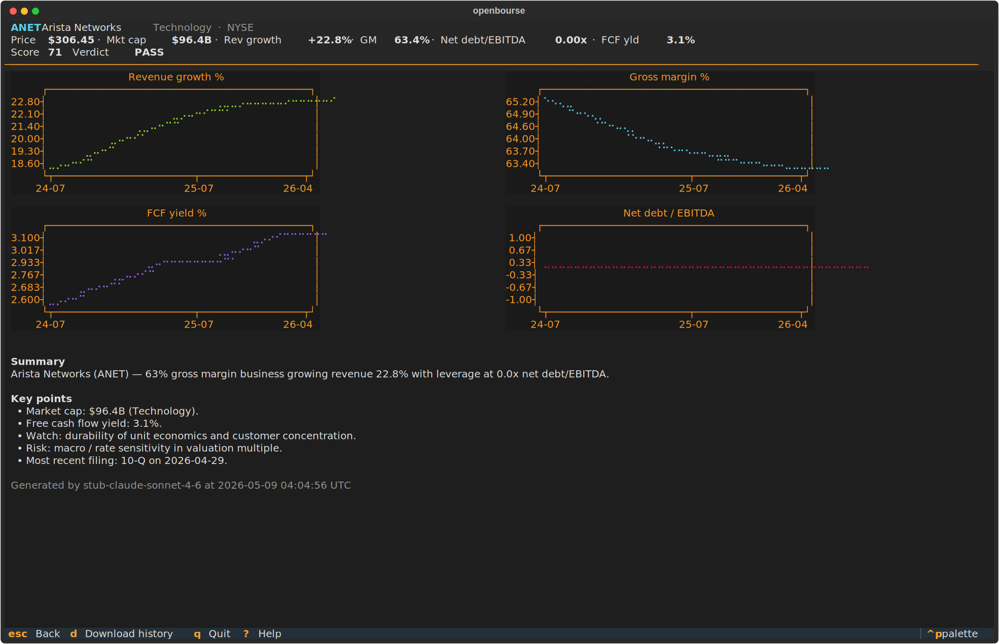
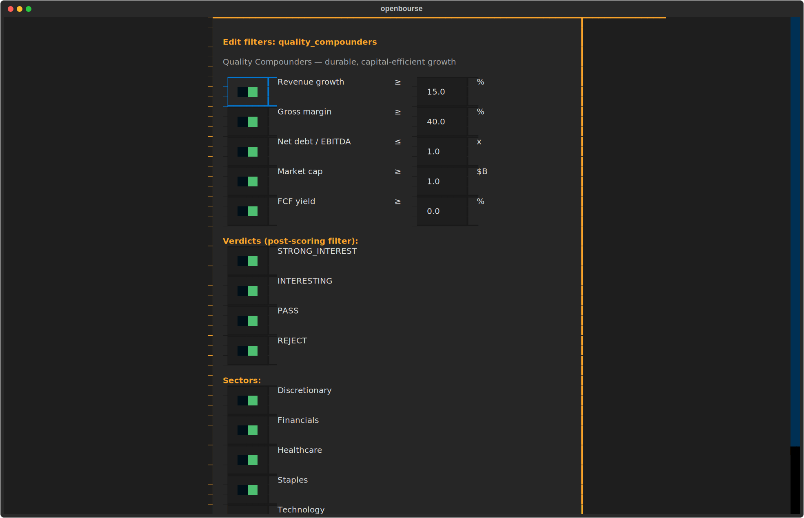

# openbourse

[](LICENSE)
[](pyproject.toml)
[](https://github.com/astral-sh/ruff)

A Bloomberg-like terminal equity research workstation. `openbourse` screens
public companies against quantitative criteria, scores them with a transparent
composite formula, and surfaces AI-generated briefs — all from a Textual TUI
backed by PostgreSQL.

> **Status:** early scaffold. The default fundamentals provider is **Yahoo
> Finance via `yfinance`** — no API key, no quota, ~150,000 tickers. FMP
> and Anthropic Claude are optional and slot in via env vars when you want
> them. Stubs are still available for offline development and tests.

## Screens

The main screener — universe stats, candidates table sorted by composite
score, and a live detail pane that updates as you move the cursor. The
right pane shows the focused company's metrics, score, verdict, and a
short business description from the data provider.



The brief screen — fundamentals header with style-fit %, 2×2 grid of
annual history charts, and a structured AI brief: Summary, Bull case,
Bear case, Risks to monitor, plus a user-defined Concerns checklist.
With a Claude API key the concerns section gets refined in place by a
background worker that pulls the company's most-recent 10-K from EDGAR,
extracts Item 1A. Risk Factors, and surfaces verbatim quotes as
evidence — fabricated quotes are dropped post-hoc. Scan results are
cached, so repeat visits don't re-pay for the call.



Press `f` to open the filter editor. Toggle any criterion on or off,
tweak its threshold, or restrict the verdict set — apply, and the
candidates list re-runs in place.



> Screenshots are captured by `scripts/take_screenshots.py` against the
> bundled stub dataset, so anyone can regenerate them after a UI change.

## Highlights

- **Textual TUI** — keyboard-driven research with live history charts,
  business descriptions, fast-scroll keys, and a `bourse>` command bar.
- **Free by default** — yfinance for fundamentals, no API key. FMP and
  Anthropic Claude are optional upgrades via env vars.
- **Pluggable providers** — `FundamentalsProvider`, `FilingsProvider`,
  `BriefProvider`, and `ConcernScanner` share small async Protocols; swap
  implementations without touching call sites.
- **Editable filters** — toggle each criterion on or off and tweak
  thresholds from inside the TUI (`f` key). Verdict-level filtering too.
- **Transparent scoring** — composite score and verdict thresholds are pure
  functions in `openbourse.screening.scoring`, fully unit-tested.
- **Universe ingest** — `bourse universe ingest --source sp500` (or
  `russell2000`, `nasdaq100`, etc.) builds your screening universe from
  Wikipedia + iShares ETF holdings.
- **SQLAlchemy 2.0 async + Alembic** — typed `Mapped[]` models, versioned
  migrations, repository-pattern data access.
- **Apache 2.0 licensed** — designed to be forked, vendored, and extended.

## Quick start

### Prerequisites

- Python 3.11 or newer
- [Poetry](https://python-poetry.org/) 2.0+
- PostgreSQL 14+ (or run the bundled `docker compose` service)

### Install

```bash
git clone https://github.com/OpenBourse/openbourse.git
cd openbourse
poetry install
cp .env.example .env
```

### Database

Start a local Postgres with the bundled compose file and run migrations:

```bash
docker compose up -d postgres
poetry run bourse db migrate
```

> The compose service binds Postgres to host port **5433** by default to
> avoid colliding with any other Postgres you already have on 5432. Override
> with `OPENBOURSE_PG_HOST_PORT` in `.env` and update `OPENBOURSE_DATABASE_URL`
> to match.

### Ingest fundamentals (Yahoo Finance, no API key)

`openbourse` defaults to **yfinance** for fundamentals — completely free,
unmetered (in practice), and covers ~150,000 tickers. The recommended
flow for a fresh install:

```bash
# Try a small ingest first to confirm the pipeline works.
poetry run bourse universe ingest --source sp500 --limit 10

# Then backfill a real universe. Pick one:
poetry run bourse universe ingest --source sp500       # 503 names, ~3 min
poetry run bourse universe ingest --source nasdaq100   # 101 names, ~30 sec
poetry run bourse universe ingest --source russell2000 # 1,919 names, ~7 min
poetry run bourse universe ingest --source russell3000 # 2,921 names, ~10 min

# With history (3-4 annual snapshots per ticker, 4× the calls).
poetry run bourse universe ingest --source sp500 --with-history --rate 0.5

# Refresh after earnings season — only re-fetch rows older than N days.
poetry run bourse universe ingest --source sp500 --stale-after 30
```

If you're offline or want to demo the app without network access, the
bundled fixture dataset still works:

```bash
poetry run bourse db seed   # loads 10 hand-curated tickers from seed.json
```

Available sources, including their underlying URLs:

```bash
poetry run bourse universe sources
```

### Launch the TUI

```bash
poetry run bourse run
```

Press `?` inside the app for keybindings. Some highlights:

| Key | Action |
|---|---|
| `↑` `↓` | Move 1 row · `g` `G` jump to top/bottom · `[` `]` ±25 · `{` `}` ±100 |
| `Enter` | Open the brief screen with charts and (optional) AI summary |
| `f` | Edit filters — toggle any criterion on/off, tweak thresholds |
| `:` or `/` | Focus the bottom command bar (`:screen all`, `:lookup INTC`, etc.) |
| `d` | Download annual history for the focused row |
| `q` | Quit |

### Optional: upgrade to FMP or add Claude briefs

Both are entirely optional. If you have credentials, set them in `.env`:

```bash
# Use FMP instead of yfinance (paid plans give finer-grained data).
OPENBOURSE_FUNDAMENTALS_PROVIDER=fmp
OPENBOURSE_FMP_API_KEY=your-fmp-key

# Generate AI briefs in the brief screen and `bourse lookup --brief`.
OPENBOURSE_CLAUDE_API_KEY=sk-ant-...
OPENBOURSE_CLAUDE_MODEL=claude-sonnet-4-6

# SEC EDGAR requires a descriptive User-Agent identifying you.
OPENBOURSE_EDGAR_USER_AGENT=Your Name your.email@example.com
```

The status bar at the top of the TUI shows which providers are live vs
stubbed at any moment.

## CLI

```text
bourse run                       Launch the TUI.
bourse run --screen NAME         Launch with a specific screen
                                 (all, quality_compounders, deep_value, high_growth).
bourse lookup TICKER             Look up fundamentals for a single ticker.
bourse lookup TICKER -b          Same, plus an AI-generated brief.
bourse lookup TICKER --history   Same, plus annual history (persisted to DB).
bourse universe ingest -s sp500  Bulk-ingest a list of tickers via yfinance.
bourse universe sources          List available --source values.
bourse universe fetch-list NAME  Print a fresh ticker list to stdout.
bourse db migrate                Apply Alembic migrations to the configured DB.
bourse db seed                   Load the bundled fixture dataset.
bourse screen list               Show available screens (text mode, no TUI).
bourse screen run NAME           Run a screen and print results as a table or JSON.
bourse version                   Print version and exit.
```

Inside the TUI press `/` (or `:`) to open the command bar — same pipeline,
just keyboard-driven (`:lookup INTC`, `:screen all`, `:brief CDNS`, etc.).

All commands respect the `OPENBOURSE_*` environment variables in `.env`.

## Project layout

```
src/openbourse/
  cli.py            Typer entry point — exposes the `bourse` command.
  config.py         pydantic-settings config from environment.
  db/               SQLAlchemy 2.0 models, engine, repositories.
  domain/           Plain dataclasses representing business objects.
  providers/        FMP, EDGAR, Claude clients (real + stubbed).
  screening/        Criteria, composite scoring, verdict thresholds.
  tui/              Textual app, screens, widgets, styles.
alembic/            Migration environment + versioned scripts.
tests/              pytest suites — unit and integration.
docs/               Architecture and contribution docs.
```

See [docs/architecture.md](docs/architecture.md) for the design walkthrough.

## Development

```bash
poetry install --with dev
poetry run pre-commit install
poetry run pytest                 # unit tests, no DB needed
poetry run pytest -m integration  # requires Postgres from docker compose
poetry run ruff check .
poetry run mypy src
```

The CI workflow at `.github/workflows/ci.yml` runs the same checks on every
push and pull request.

## Contributing

Bug reports, feature ideas, and provider implementations are welcome. Please
read [CONTRIBUTING.md](CONTRIBUTING.md) and our
[Code of Conduct](CODE_OF_CONDUCT.md) before opening a pull request.

## License

`openbourse` is licensed under the [Apache License, Version 2.0](LICENSE).
See [NOTICE](NOTICE) for attribution requirements.

## Disclaimer

`openbourse` is a research tool. Outputs are for informational purposes only
and do not constitute financial, investment, legal, or tax advice. The
authors and contributors assume no liability for decisions made using this
software. Always do your own research.
